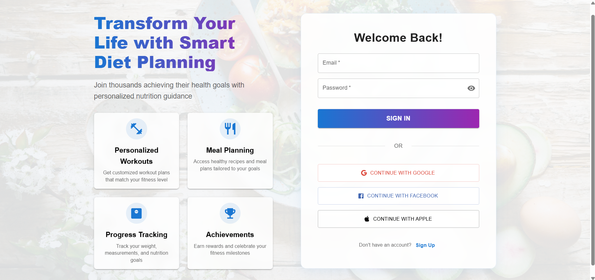
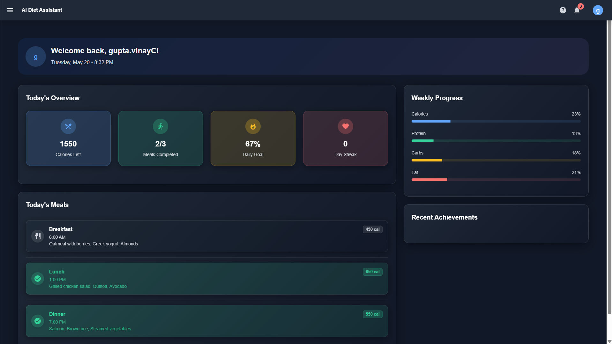
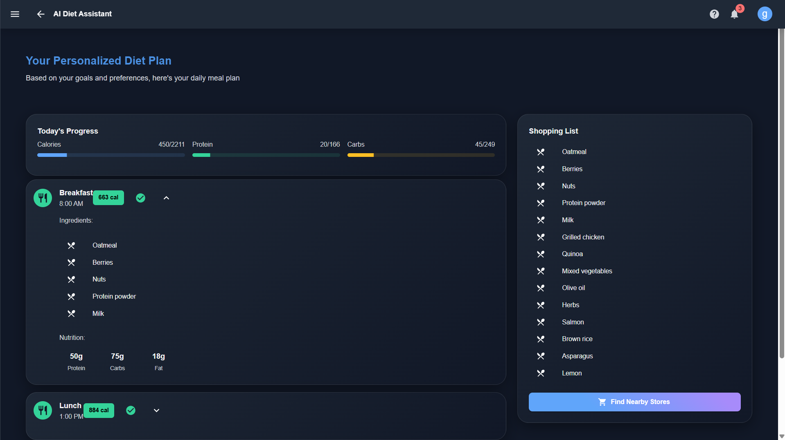
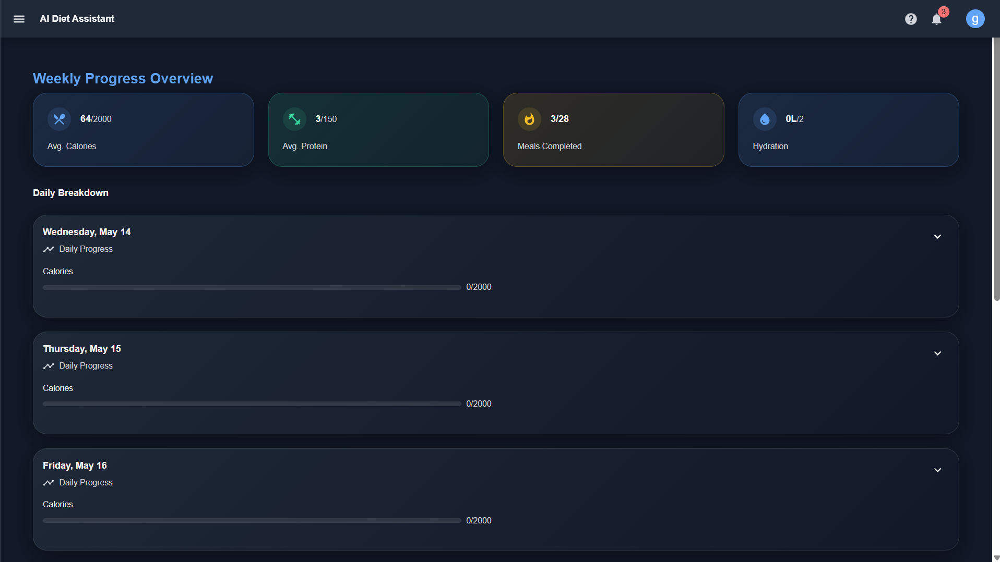
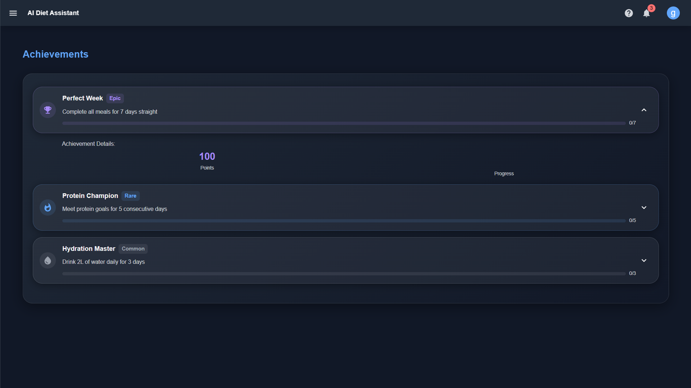
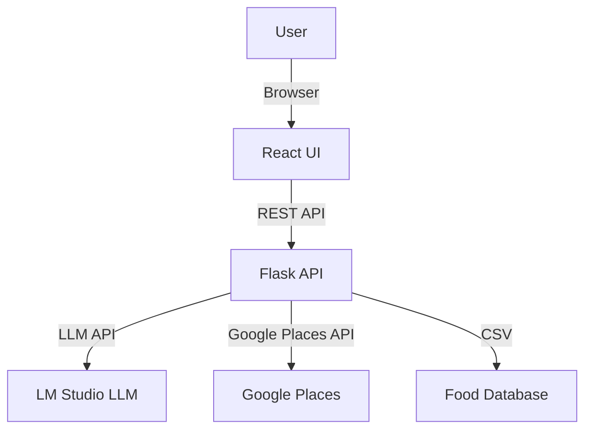

# SemiHealth - AI Diet Assistant

Transform your health journey with SemiHealth, a full-stack AI-powered diet and nutrition assistant. This project leverages modern web technologies and local LLMs to deliver personalized meal plans, nutrition analysis, and smart recommendations, all in a beautiful, user-friendly interface.

---

## 🚀 Project Overview
SemiHealth is a full-stack application that helps users:
- Generate personalized diet plans based on their profile, restrictions, and health goals
- Get AI-powered meal suggestions and explanations (using local LLM via LM Studio)
- Find nearby healthy restaurants and grocery stores (Google Places API)
- Track progress and celebrate achievements

---

## 📸 Project Screenshots

### 1. Login & Welcome Page

*Modern, user-friendly login page with social sign-in options and a welcoming introduction.*

### 2. Dashboard Overview

*Personalized dashboard showing calories, meals, daily goals, streaks, and a summary of today's meals.*

### 3. Weekly Progress Tracking

*Track your weekly calories, protein, meals completed, and hydration with a detailed daily breakdown.*

### 4. Personalized Diet Plan

*AI-generated daily meal plan with nutrition breakdown and a smart shopping list for easy meal prep.*

### 5. Achievements & Rewards

*Gamified achievements to motivate users, including streaks, protein goals, and hydration milestones.*

---

## 🌟 Why This Project Stands Out
- **End-to-End AI Integration:** Combines classic web dev with cutting-edge local LLMs for real, practical AI use.
- **Privacy-First:** All AI runs locally—no user data leaves your machine.
- **Modular & Extensible:** Clean, well-organized codebase makes it easy to add new features or swap components.
- **Real-World Relevance:** Tackles a meaningful problem—personalized health and nutrition.
- **Modern Stack:** Uses the latest in React, TypeScript, Flask, and AI APIs.
- **Beautiful UI:** Professional, responsive design with Material UI.
- **Open Source Spirit:** Built for learning, sharing, and community improvement.

---

## 🤝 For Developers: How to Contribute & Learn
- **Explore Modular Code:** Each feature (diet, nutrition, LLM, places) is in its own module for clarity.
- **Add Your Own AI Models:** Swap in any OpenAI-compatible LLM in LM Studio—experiment with prompts and outputs!
- **Improve the UI/UX:** The React frontend is easy to extend with new pages, themes, or components.
- **API-First Design:** All business logic is exposed via RESTful APIs—perfect for mobile or other frontends.
- **Learn Best Practices:** See examples of environment config, error handling, and scalable project structure.
- **Contribute:** Fork, branch, and PR! Suggestions, bugfixes, and new features are welcome.
- **Great for Portfolios:** Use this as a template or inspiration for your own AI-powered apps.

---

## ✨ Features

### 🍽️ **Nutrition & Diet**
- **User Profile Management**: Age, gender, weight, height, activity, restrictions, health conditions
- **Personalized Diet Generation**: Smart meal plans tailored to user needs
- **AI Meal Suggestions**: Detailed, context-aware meal ideas from a local LLM
- **Nutrition Analysis**: Macro/micro breakdown for each plan
- **Dynamic Macro Ratio Control**: Adjust protein/carbs/fat ratios with interactive sliders (10-60% range)
- **Intelligent Water Calculator**: Personalized daily water intake recommendations based on body weight and activity level

### 🏋️‍♂️ **Fitness & Workouts** *(New in v1.2.0)*
- **Complete Workouts Section**: Dedicated fitness page with comprehensive workout management
- **Exercise Library**: 4 main categories (Cardio, Strength, HIIT, Yoga) with exercise examples
- **Today's Workout Overview**: Current workout plan with progress tracking
- **Workout History**: Complete log of past workouts with detailed metrics
- **Weekly Fitness Stats**: Comprehensive analytics (total workouts, duration, calories, averages)
- **Quick Workout Logger**: Easy-to-use form for manual workout entry
- **Fitness-Diet Integration**: Post-workout nutrition suggestions and calorie adjustments

### 🌍 **Location & Discovery**
- **Nearby Restaurants & Stores**: Find healthy options near you (Google Places API)

### 📊 **Progress & Gamification**
- **Progress Tracking & Achievements**: Visualize and celebrate your health journey
- **Real-time Dashboard**: Combined nutrition and fitness overview
- **Interactive Charts**: Visual progress representation with smooth animations

### 🎨 **User Experience**
- **Modern UI/UX**: Responsive, clean React interface with Material UI
- **Dark/Light Theme**: Toggle between themes with consistent design language
- **Motion Animations**: Smooth transitions and hover effects throughout the app
- **Mobile-First Design**: Fully responsive across all device sizes

---

## 🛠️ Tech Stack
- **Frontend**: React, TypeScript, Material UI, Axios
- **Backend**: Flask, Flask-CORS, Python, Pandas, Requests
- **AI/LLM**: LM Studio (OpenAI-compatible local server), Phi 3.1 Mini 128k Instruct (recommended)
- **Data**: CSV-based food database
- **APIs**: Google Places (for restaurants/stores)

---

## 🏗️ Architecture


---

## ⚡ Quickstart

### 1. Clone the Repository
```bash
git clone https://github.com/yourusername/ai-diet-assistant.git
cd ai-diet-assistant
```

### 2. Backend Setup
```bash
# Create and activate a virtual environment
python -m venv venv
./venv/Scripts/activate  # On Windows
# Install dependencies
pip install -r requirements.txt
# Add your .env file (see below)
```

#### .env Example
```
GOOGLE_PLACES_API_KEY=your_google_api_key_here
FLASK_ENV=development
FLASK_DEBUG=1
```

### 3. Frontend Setup
```bash
cd src/frontend/diet-assistant-ui
npm install
# (Optional) Add .env for API URL
# echo REACT_APP_API_URL=http://localhost:5000 > .env
npm start
```

### 4. LLM (LM Studio) Setup
- Download and install [LM Studio](https://lmstudio.ai/)
- Download the model: **Phi 3.1 Mini 128k Instruct** (IQ3_M or Q4_K_M recommended)
- Start LM Studio and load the model
- Ensure the OpenAI-compatible API server is running at `http://127.0.0.1:1234`

---

## 🧑‍💻 Usage
- Open [http://localhost:3000](http://localhost:3000) in your browser
- Sign up or log in (UI only, no real authentication)
- Enter your profile details and generate a personalized diet plan
- Explore meal suggestions, nutrition breakdown, and local healthy options
- **🆕 Adjust macro ratios** using the sliders in Today's Progress section
- **🆕 Calculate optimal water intake** using the Water Calculator

---

## 🆕 Recent Updates (August 2025)

### Enhanced Dashboard Features
We've significantly improved the user experience with two major additions:

#### 1. 🎛️ Dynamic Macro Ratio Control
- **Interactive Sliders**: Fine-tune your protein, carbs, and fat ratios directly from the dashboard
- **Real-time Updates**: Progress bars automatically recalculate based on your preferred macro distribution
- **Smart Balancing**: When you adjust one macro, the others automatically rebalance to maintain 100%
- **Range Control**: Adjust each macro between 10-60% to suit your dietary preferences
- **Visual Feedback**: Immediate visual feedback with color-coded sliders matching each nutrient

#### 2. 💧 Intelligent Water Calculator
- **Personalized Recommendations**: Get daily water intake suggestions based on your exact body weight
- **Activity Level Adjustment**: Automatically factors in your activity level for more accurate recommendations
- **Easy Input**: Simple weight input with automatic calculation
- **Visual Progress**: Track your daily water intake with a dedicated progress bar
- **Practical Conversion**: Shows recommendations in both milliliters and standard glasses (250ml each)
- **Scientific Formula**: Uses the proven 35ml per kg body weight baseline with activity multipliers

### Technical Improvements
- **Preserved Design System**: All new features seamlessly integrate with the existing dark theme and Material-UI components
- **Responsive Layout**: New components are fully responsive and maintain the app's mobile-friendly design
- **Performance Optimized**: Real-time calculations with minimal performance impact
- **Type Safety**: Full TypeScript support for all new features

### How to Use New Features
1. **Macro Adjustment**: Navigate to Dashboard → Today's Progress → Use sliders under each nutrient bar
2. **Water Calculator**: Navigate to Dashboard → Water Calculator section → Enter weight → Click "Calculate Recommended Intake"

---

## 🔧 Customization & Extensibility
- **Add more foods**: Edit `data/food_database.csv`
- **Change LLM prompts**: Edit `src/llm_integration.py`
- **Swap LLM models**: Use any OpenAI-compatible model in LM Studio
- **Add authentication**: Integrate with Firebase/Auth0 or Flask-Login
- **Deploy**: Use Heroku, Vercel, or your preferred cloud provider

---

## 🩺 Troubleshooting
- **LLM not responding?**
  - Ensure LM Studio is running and model is loaded
  - Check that the model name in `src/llm_integration.py` matches LM Studio
  - Make sure the API URL is `http://127.0.0.1:1234/v1/chat/completions`
- **Google Places not working?**
  - Add a valid API key to your `.env` file
  - Check backend logs for errors
- **Frontend/backend connection issues?**
  - Ensure both servers are running
  - Check CORS settings in Flask

---

## 🙏 Credits
- [LM Studio](https://lmstudio.ai/) for local LLM serving
- [Phi 3.1 Mini](https://huggingface.co/microsoft/Phi-3-mini-128k-instruct) for the model
- [Material UI](https://mui.com/) for UI components
- [Google Places API](https://developers.google.com/maps/documentation/places/web-service/overview)

---

## 📅 Changelog

### Version 1.2.0 (August 23, 2025)
**🏋️‍♂️ Major Feature: Fitness Integration**
- ✅ **Complete Workouts Section**: New dedicated fitness page accessible from sidebar
- ✅ **Today's Workout Card**: Exercise type, duration, calories burned with progress ring
- ✅ **Exercise Library**: 4 categories (Cardio, Strength, HIIT, Yoga) with details and examples
- ✅ **Workout History**: Complete log of past workouts with date, type, duration, calories
- ✅ **Weekly Fitness Stats**: Total workouts, duration, calories, and averages
- ✅ **Quick Workout Logger**: Dialog form for manual workout entry
- ✅ **Fitness-Diet Integration**: Post-workout nutrition suggestions and bonus calorie display

**🎨 UI/UX Improvements:**
- Enhanced Dashboard with workout + nutrition cards side-by-side
- Consistent design language across fitness components
- Motion animations and hover effects for better user experience
- Color-coded exercise categories with gradient backgrounds

**🔧 Technical Improvements:**
- New `/workouts` route with full navigation integration
- Updated Navigation component to support fitness section
- Responsive grid layouts optimized for both mobile and desktop
- TypeScript interfaces for workout data structures

**📍 File Changes:**
- `src/frontend/diet-assistant-ui/src/components/Workouts.tsx` - New component
- `src/frontend/diet-assistant-ui/src/components/Navigation.tsx` - Updated sidebar
- `src/frontend/diet-assistant-ui/src/components/Dashboard.tsx` - Added fitness cards
- `src/frontend/diet-assistant-ui/src/App.tsx` - Added routing and imports

**⚠️ Current Limitations:**
- Workout data is currently mock/static (no persistent storage)
- No backend integration for workout logging
- Progress tracking uses sample data only

### Version 1.1.0 (August 21, 2025)
**🆕 New Features:**
- ✅ Dynamic Macro Ratio Control with interactive sliders
- ✅ Intelligent Water Calculator with personalized recommendations
- ✅ Real-time progress bar updates based on macro adjustments
- ✅ Activity level integration for water intake calculations

**🔧 Technical Improvements:**
- Enhanced Dashboard component with new state management
- Added TypeScript support for macro ratio calculations
- Improved responsive design for new components
- Maintained existing dark theme consistency

**📍 File Changes:**
- `src/frontend/diet-assistant-ui/src/components/Dashboard.tsx` - Major updates
- `README.md` - Documentation updates

### Version 1.0.0 (Initial Release)
**🚀 Core Features:**
- AI Diet Assistant with LM Studio integration
- User profile management
- Personalized diet generation
- Progress tracking and achievements
- Restaurant and store finder
- Modern React UI with Material-UI

---

## 📄 License
This project is licensed under the MIT License. See [LICENSE](LICENSE) for details.
