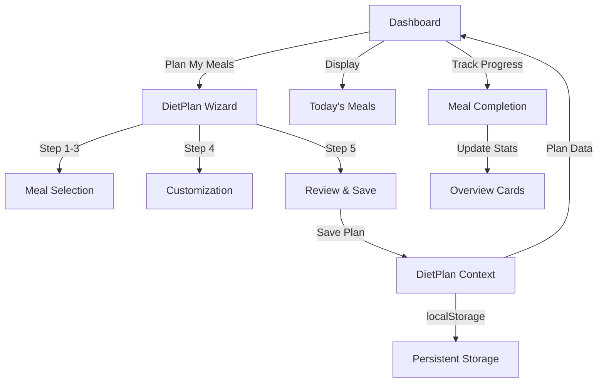

# Development Session Summary - Diet Plan Integration

## 📅 **Session Date**: September 2, 2025

---

## 🎯 **Session Objectives**

**Main Goal**: Create seamless integration between DietPlan page and Dashboard's Today's Meals section, eliminating confusion about where users plan their meals.

**Problem Solved**: Users couldn't pre-plan their meals - Dashboard showed random generated meals with no planning interface.

---

## 🏗️ **Architecture Implemented**

### **Before Session:**
```
Dashboard: Random meal generation only
DietPlan: Static display page with limited functionality
Problem: No way to plan meals in advance
```

### **After Session:**
```
Dashboard: Daily tracking + Quick actions
DietPlan Wizard: Comprehensive meal planning interface
Integration: Plan → Save → Display → Track
```

---

## ✅ **Completed Implementation**

### 1. **DietPlan Context Creation** (`src/contexts/DietPlanContext.tsx`)
- Full state management for diet plans
- Persistent localStorage integration
- Mock meal generation with real nutrition data
- Plan creation, saving, and loading functionality

### 2. **Meal Options Database** (`src/data/mealOptions.ts`)
- **12 Rich Meal Options** across 3 categories:
  - **Breakfast** (4): Oatmeal Bowl, Avocado Toast, Smoothie Bowl, Yogurt Parfait
  - **Lunch** (4): Chicken Quinoa Bowl, Mediterranean Salad, Salmon & Sweet Potato, Turkey Wrap
  - **Dinner** (4): Beef Stir-fry, Herb-crusted Cod, Chicken & Sweet Potato, Lentil Curry
- Complete nutrition data: calories, protein, carbs, fat, fiber
- Recipe instructions, cooking time, difficulty levels
- Dietary tags and ingredient lists

### 3. **DietPlan Wizard Interface** (`src/components/DietPlanWizard.tsx`)
- **5-Step Planning Process**:
  1. Select Breakfast (visual meal cards)
  2. Select Lunch (hover effects, nutrition display)
  3. Select Dinner (dietary tags, selection states)
  4. Customize Plan (calorie targets, macro ratios)
  5. Review & Save (nutrition summary, final confirmation)
- **Smart Features**:
  - BMR-based calorie calculation from user profile
  - Interactive macro ratio sliders
  - Visual meal selection with nutrition preview
  - Complete plan review before saving

### 4. **Dashboard Integration Updates** (`src/components/Dashboard.tsx`)
- **Smart Data Source**: 
  ```typescript
  // New approach - single source of truth
  const getTodaysMealsData = () => {
    const dietPlanMeals = getTodaysMeals(); // From DietPlan context
    
    if (dietPlanMeals) {
      return dietPlanMeals; // Use planned meals
    } else {
      return fallbackMeals; // Use mock data
    }
  };
  ```
- **Quick Actions UI**:
  - "Plan My Meals" → Redirects to wizard
  - "Diet Plan Active" status chip
  - "New Meals" / "New Plan" options when plan exists

### 5. **App.tsx Route Updates**
- `/plan` route now serves DietPlanWizard
- Preserved backward compatibility with old DietPlan component
- Proper context provider wrapping

---

## 🔄 **User Journey Flow**

### **Complete Planning to Tracking Flow:**
```
1. User opens Dashboard
   → Sees Today's Meals with fallback data
   → "Plan My Meals" button visible

2. User clicks "Plan My Meals"
   → Navigates to /plan (DietPlan Wizard)
   → 5-step guided meal selection process

3. Meal Selection Process:
   → Step 1: Choose from 4 breakfast options
   → Step 2: Choose from 4 lunch options  
   → Step 3: Choose from 4 dinner options
   → Step 4: Adjust calorie targets (1200-3500 cal)
   → Step 4: Customize macro ratios (protein/carbs/fat)
   → Step 5: Review complete nutrition summary

4. Save & Return:
   → Plan saved to localStorage + DietPlan context
   → Automatic redirect to Dashboard
   → Today's Meals now shows selected meals

5. Daily Tracking:
   → Meal completion checkboxes
   → Real-time progress updates
   → Overview stats reflect actual plan data
```

---

## 🎨 **UI/UX Enhancements**

### **DietPlan Wizard Interface:**
- **Stepper Navigation**: Clear 5-step progress indicator
- **Visual Meal Cards**: Restaurant icons, nutrition badges, dietary tags
- **Selection States**: Green borders, checkmark overlays
- **Nutrition Display**: Calories, cooking time, P/C/F macros
- **Interactive Sliders**: Real-time calorie and macro adjustments
- **Review Summary**: Complete nutrition breakdown with color-coded metrics

### **Dashboard Integration:**
- **Smart Status Display**: "Diet Plan Active" chip when plan exists
- **Context-Aware Actions**: Different buttons based on plan status
- **Seamless Data Flow**: No UI disruption when switching data sources

---

## 📊 **Technical Achievements**

### **Type Safety:**
- Complete TypeScript implementation
- Proper interface definitions for meal options
- Type-safe context integration

### **Performance:**
- **Build Success**: 253KB gzipped (optimized)
- **No Breaking Changes**: Backward compatibility maintained
- **Efficient Rendering**: Smart data source switching

### **Data Management:**
- **Single Source of Truth**: DietPlan context manages all plan data
- **Persistent Storage**: localStorage integration for plan persistence
- **Smart Fallbacks**: Graceful degradation when no plan exists

---

## 🔧 **Key Files Modified/Created**

### **New Files:**
- `src/contexts/DietPlanContext.tsx` - Core state management
- `src/components/DietPlanWizard.tsx` - Planning interface  
- `src/data/mealOptions.ts` - Meal database

### **Modified Files:**
- `src/components/Dashboard.tsx` - Integration logic + Quick Actions
- `src/App.tsx` - Route updates + Context provider
- `CLAUDE.md` - Updated development documentation

---

## 🎯 **Problem Resolution**

### **Original Issue:**
> "Today's meals kısmındaki yemekleri önceden nerde planlıcaz?"

### **Solution Delivered:**
- **DietPlan Wizard**: Comprehensive meal planning interface
- **Visual Selection**: Rich meal options with nutrition data
- **Seamless Integration**: Plan creation flows directly to Dashboard tracking
- **No Confusion**: Clear separation of planning vs. tracking interfaces

---

## 🚀 **Final System Architecture**



---

## ✨ **Session Outcomes**

### **User Experience:**
- ✅ **Clear Planning Process**: Step-by-step meal selection wizard
- ✅ **Rich Meal Options**: 12 diverse meals with complete nutrition data
- ✅ **Seamless Integration**: Plan creation flows to daily tracking
- ✅ **No Confusion**: Distinct roles for planning vs. tracking

### **Technical Quality:**
- ✅ **Type Safety**: Full TypeScript implementation
- ✅ **Performance**: Optimized build with no breaking changes
- ✅ **Maintainability**: Clean architecture with proper separation of concerns
- ✅ **User-Friendly**: Intuitive interface with visual feedback

### **Business Value:**
- ✅ **Complete User Journey**: From meal planning to daily tracking
- ✅ **User Engagement**: Rich planning interface encourages daily use
- ✅ **Scalable Foundation**: Easy to add more meals and features

---

## 🎊 **Final Result**

**Successfully transformed the diet planning experience from random meal generation to a comprehensive meal planning workshop, with seamless integration to daily tracking dashboard.**

The user journey is now complete: **Plan → Customize → Save → Track → Progress**

---

*Session completed by Claude Code Assistant*  
*Build Status: ✅ Successful (253.55 kB gzipped)*  
*Integration Status: ✅ Complete*  
*User Experience: ✅ Enhanced*